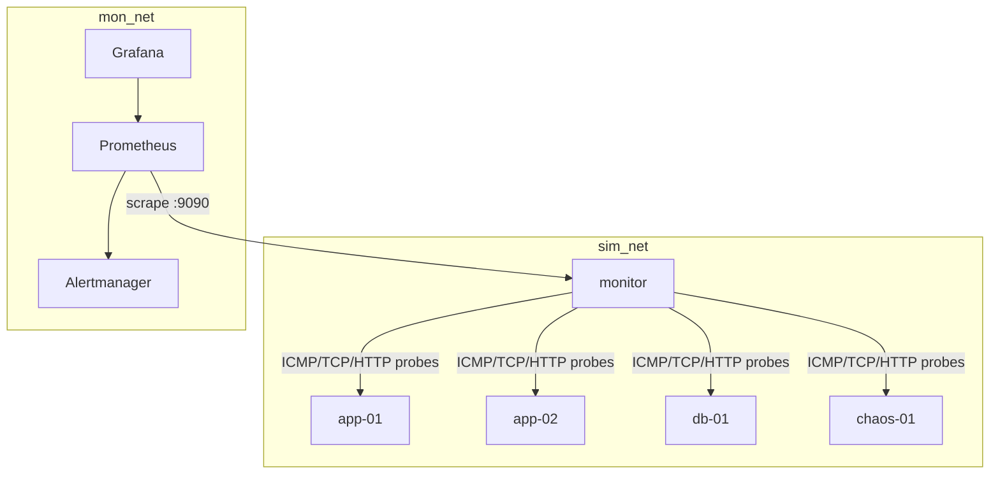

# Architecture

## High-level

One Python process (`monitor`) runs the entire control plane as asyncio
tasks; Prometheus scrapes its metrics endpoint, Alertmanager routes alerts,
Grafana visualizes. The simulated infrastructure is four containers on a
Docker bridge network (`sim_net`); the observability stack lives on
`mon_net`. Only the monitor spans both — the same monitoring-plane /
production-plane separation used in real environments.



## Component responsibilities

| Component | Responsibility | Explicitly NOT its job |
|---|---|---|
| Probes (`src/netmon/probes/`) | One stateless measurement → `ProbeResult` | Retries, thresholds, state |
| `TargetRunner` (`engine.py`) | Runs one target's probes on schedule, feeds the state machines | Remediation |
| `HealthStateMachine` (`health/state_machine.py`) | Hysteretic state transitions per target per probe type | Deciding what to do about failures |
| `FailureClassifier` | Map probe-state matrix → failure class | Executing fixes |
| `RemediationEngine` (`remediation/`) | Policy lookup, cooldown, circuit breaker, allowlisted action, verification | Monitoring |
| `Orchestrator` | Incident lifecycle: open on unhealthy, close on verified recovery | Probing |
| `IncidentStore` (`storage/store.py`) | Durable incidents, transitions, remediation audit, MTTR | Anything hot-path |
| FastAPI (`api/app.py`) | Operational read-only visibility | Writes (except authenticated manual trigger, future) |

## Data flow

```text
ProbeScheduler (per-target interval)
    → Probe.check() with hard timeout
    → ProbeResult(status, latency_ms, error_class)
    → HealthStateMachine.record()          (hysteresis)
        → on transition: metrics + structured log + store
        → UNHEALTHY: FailureClassifier → Orchestrator
            → incident opened (SQLite)
            → RemediationEngine (cooldown → circuit breaker → action → verify)
            → verified recovery → incident closed, MTTR recorded
```

## Key design decisions

1. **Stateless probes, stateful evaluator.** A probe answers "what happened
   this time?"; the state machine answers "what does it mean over time?".
   Mixing them makes both untestable.
2. **Per-probe state machines.** A host can ping while its HTTP 500s. Only
   independent per-probe state can distinguish network from application
   failure — the core diagnostic value of the system.
3. **Hysteresis (asymmetric thresholds).** Cheap to leave HEALTHY
   (1 failure → DEGRADED), expensive to return (2 consecutive successes).
   Prevents flapping: a target alternating up/down can never reach
   UNHEALTHY, so it can never trigger remediation storms or alert storms.
4. **Remediation as fire-and-forget.** The probe loop never blocks on
   remediation; the orchestrator runs it as a separate task with its own
   timeouts. A hung `docker restart` cannot stall monitoring.
5. **SQLite, not a server DB.** One writer, low write volume, zero ops.
   The Store interface is the swap point if that ever changes.

See also: [remediation.md](remediation.md), [security.md](security.md),
[networking.md](networking.md).
